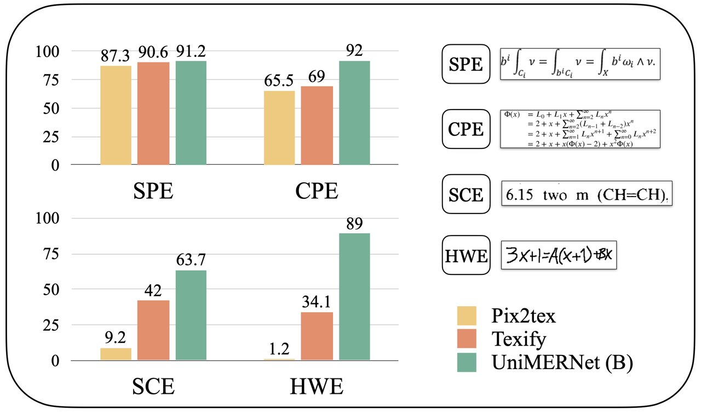
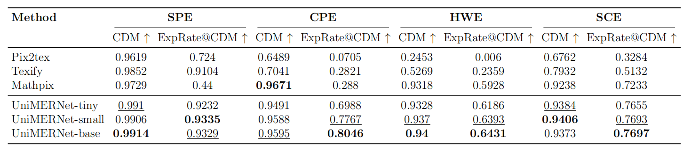

<div align="center">

English | [简体中文](./README-zh_CN.md) | [日本語](./README-ja.md)


<h1>UniMERNet: A Universal Network for Real-World Mathematical Expression Recognition</h1>


[[ Paper ]](https://arxiv.org/abs/2404.15254) [[ Website ]](https://github.com/opendatalab/UniMERNet/tree/main) [[ Dataset (OpenDataLab)]](https://opendatalab.com/OpenDataLab/UniMER-Dataset) [[ Dataset (Hugging Face) ]](https://huggingface.co/datasets/wanderkid/UniMER_Dataset)


[[Models 🤗(Hugging Face)]](https://huggingface.co/wanderkid/unimernet_base)
[[Models (ModelScope)]](https://www.modelscope.cn/models/wanderkid/unimernet_base)

🔥🔥 [CDM: A Reliable Metric for Fair and Accurate Formula Recognition Evaluation](https://github.com/opendatalab/UniMERNet/tree/main/cdm)

</div>

Welcome to the official repository of UniMERNet, a solution that converts images of mathematical expressions into LaTeX, suitable for a wide range of real-world scenarios.

## News 🚀🚀🚀
**2025.09.28** 🎉🎉  CDM support chinese formula evaluation now.  
**2025.03.25** 🎉🎉 <font color="red">The paper on our new formula recognition metric, [CDM](https://arxiv.org/abs/2409.03643), has been accepted by CVPR 2025. We invite everyone to use it.</font>  
**2024.09.06** 🎉🎉  UniMERNet Update: The new version features a smaller model and faster inference. Training code is now open-sourced. For details, see the latest paper [UniMERNet](https://arxiv.org/abs/2404.15254).  
**2024.09.06** 🎉🎉  Introducing a new metric for formula recognition: [CDM](https://github.com/opendatalab/UniMERNet/tree/main/cdm). Compared to BLEU/EditDistance, CDM provides a more intuitive and accurate evaluation score, allowing for fair comparison of different models without being affected by formula expression diversity.  
**2024.07.21** 🎉🎉  Add Math Formula Detection (MFD) Tutorial based on [PDF-Extract-Kit](https://github.com/opendatalab/PDF-Extract-Kit) MFD model.    
**2024.06.06** 🎉🎉  Open-sourced evaluation code for UniMER dataset.  
**2024.05.06** 🎉🎉  Open-sourced UniMER dataset, including UniMER-1M for model training and UniMER-Test for MER evaluation.  
**2024.05.06** 🎉🎉  Add Streamlit formula recognition demo and provided local deployment App.  
**2024.04.24** 🎉🎉  Paper now available on [ArXiv](https://arxiv.org/abs/2404.15254).  
**2024.04.24** 🎉🎉  Inference code and checkpoints have been released. 


## Demo Video
https://github.com/opendatalab/UniMERNet/assets/69186975/ac54c6b9-442c-48b0-95f9-a4a3fce8780b


https://github.com/opendatalab/UniMERNet/assets/69186975/09b71c55-c58a-4792-afc1-d5774880ccf8

## Quick Start

### Clone the repo and download the model
```bash
git clone https://github.com/opendatalab/UniMERNet.git
```

```bash
cd UniMERNet/models
# Download the model and tokenizer individually or use git-lfs
git lfs install
git clone https://huggingface.co/wanderkid/unimernet_base  # 1.3GB  
git clone https://huggingface.co/wanderkid/unimernet_small # 773MB  
git clone https://huggingface.co/wanderkid/unimernet_tiny  # 441MB  

# you can also download the model from ModelScope
git clone https://www.modelscope.cn/wanderkid/unimernet_base.git
git clone https://www.modelscope.cn/wanderkid/unimernet_small.git
git clone https://www.modelscope.cn/wanderkid/unimernet_tiny.git

```

### Installation

> Create a clean Conda environment

```bash
conda create -n unimernet python=3.10
conda activate unimernet
```

> Method 1: Install via pip (recommended for general users)

```bash
pip install -U "unimernet[full]"
```

> Method 2: Local installation (recommended for developers)

```bash
pip install -e ."[full]"
```


### Running UniMERNet

1. **Streamlit Application**: For an interactive and user-friendly experience, use our Streamlit-based GUI. This application allows real-time formula recognition and rendering.

    ```bash
    unimernet_gui
    ```
    Ensure you have the latest version of UniMERNet installed (`pip install --upgrade unimernet & pip install "unimernet[full]"`) for the streamlit GUI application.

2. **Command-line Demo**: Predict LaTeX code from an image.

    ```bash
    python demo.py
    ```

3. **Jupyter Notebook Demo**: Recognize and render formula from an image.

    ```bash
    jupyter-lab ./demo.ipynb
    ```


## Performance Comparison (BLEU) with SOTA Methods.

> UniMERNet significantly outperforms mainstream models in recognizing real-world mathematical expressions, demonstrating superior performance across Simple Printed Expressions (SPE), Complex Printed Expressions (CPE), Screen-Captured Expressions (SCE), and Handwritten Expressions (HWE), as evidenced by the comparative BLEU Score evaluation.  



## Performance Comparison (CDM) with SOTA Methods.

> Due to the diversity of expression of formulas, it is unfair to compare different models by BLEU metric. Therefore, we conduct evaluation by CDM, a specially designed metric for formula recognition. Our method is far superior to the open source model and has the same effect as that of commercial software Mathpix. CDM@ExpRate means that the proportion of correct formulas is completely predicted. Refer to [CDM](https://arxiv.org/pdf/2409.03643) paper for details.



## Visualization Result with Different Methods.

> UniMERNet excels in visual recognition of challenging samples, outperforming other methods.  


## UniMER Dataset
### Introduction
The UniMER dataset is a specialized collection curated to advance the field of Mathematical Expression Recognition (MER). It encompasses the comprehensive UniMER-1M training set, featuring over one million instances that represent a diverse and intricate range of mathematical expressions, coupled with the UniMER Test Set, meticulously designed to benchmark MER models against real-world scenarios. The dataset details are as follows:

**UniMER-1M Training Set:**
  - Total Samples: 1,061,791 Latex-Image pairs
  - Composition: A balanced mix of concise and complex, extended formula expressions
  - Aim: To train robust, high-accuracy MER models, enhancing recognition precision and generalization

**UniMER Test Set:**
  - Total Samples: 23,757, categorized into four types of expressions:
    - Simple Printed Expressions (SPE): 6,762 samples
    - Complex Printed Expressions (CPE): 5,921 samples
    - Screen Capture Expressions (SCE): 4,742 samples
    - Handwritten Expressions (HWE): 6,332 samples
  - Purpose: To provide a thorough evaluation of MER models across a spectrum of real-world conditions

### Dataset Download
You can download the dataset from [OpenDataLab](https://opendatalab.com/OpenDataLab/UniMER-Dataset) (recommended for users in China) or [HuggingFace](https://huggingface.co/datasets/wanderkid/UniMER_Dataset).

### Download UniMER-Test Dataset


Download the UniMER-1M dataset and extract it to the following directory:
```bash
./data/UniMER-1M
```

Download the UniMER-Test dataset and extract it to the following directory:
```bash
./data/UniMER-Test
```

## Training

To train the UniMERNet model, follow these steps:

1. **Specify the Training Dataset Path**: Open the `configs/train` fold and set the path to your training dataset.

2. **Run the Training Script**: Execute the following command to start the training process.

    ```bash
    bash script/train.sh
    ```

### Notes:
- Ensure that the dataset path specified in the `configs/train` fold is correct and accessible.
- Monitor the training process for any errors or issues.

## Testing

To test the UniMERNet model, follow these steps:

1. **Specify the Test Dataset Path**: Open the `configs/val` fold and set the path to your test dataset.

2. **Run the Test Script**: Execute the following command to start the testing process.

    ```bash
    bash script/test.sh
    ```

### Notes:
- Ensure that the dataset path specified in the `configs/val` fold is correct and accessible.
- The `test.py` script will use the specified test dataset for evaluation. Remember to change the test set path in test.py to your actual path.
- Review the test results for performance metrics and any potential issues.

## Math Formula Detection Tutorial

The prerequisite for formula recognition is to detect the areas within PDF or webpage screenshots where formulas are located. The [PDF-Extract-Kit](https://github.com/opendatalab/PDF-Extract-Kit) includes a powerful model for detecting formulas. If you wish to perform both formula detection and recognition by yourself, you can refer to the [Formula Detection Tutorial](./MFD/README.md) for guidance on deploying and using the formula detection model.


## TODO

[✅] Release inference code and checkpoints of UniMERNet.  
[✅] Release UniMER-1M and UniMER-Test.  
[✅] Open-source the Streamlit formula recognition GUI application.   
[✅] Release the training code for UniMERNet.  

## Citation
If you find our models / code / papers useful in your research, please consider giving us a star ⭐ and citing our work 📝, thank you :)
```bibtex
@misc{wang2024unimernetuniversalnetworkrealworld,
      title={UniMERNet: A Universal Network for Real-World Mathematical Expression Recognition}, 
      author={Bin Wang and Zhuangcheng Gu and Guang Liang and Chao Xu and Bo Zhang and Botian Shi and Conghui He},
      year={2024},
      eprint={2404.15254},
      archivePrefix={arXiv},
      primaryClass={cs.CV},
      url={https://arxiv.org/abs/2404.15254}, 
}

@misc{wang2024cdmreliablemetricfair,
      title={CDM: A Reliable Metric for Fair and Accurate Formula Recognition Evaluation}, 
      author={Bin Wang and Fan Wu and Linke Ouyang and Zhuangcheng Gu and Rui Zhang and Renqiu Xia and Bo Zhang and Conghui He},
      year={2024},
      eprint={2409.03643},
      archivePrefix={arXiv},
      primaryClass={cs.CV},
      url={https://arxiv.org/abs/2409.03643}, 
}
```

## Acknowledgements
- [VIGC](https://github.com/opendatalab/VIGC). The model framework is dependent on VIGC.
- [Texify](https://github.com/VikParuchuri/texify). A mainstream MER algorithm, UniMERNet data processing refers to Texify.
- [Latex-OCR](https://github.com/lukas-blecher/LaTeX-OCR). Another mainstream MER algorithm.
- [Donut](https://huggingface.co/naver-clova-ix/donut-base). The UniMERNet's Transformer Encoder-Decoder are referenced from Donut.
- [Nougat](https://github.com/facebookresearch/nougat). The tokenizer uses Nougat.

## Contact Us
If you have any questions, comments, or suggestions, please do not hesitate to contact us at wangbin@pjlab.org.cn.

## License
[Apache License 2.0](LICENSE)
