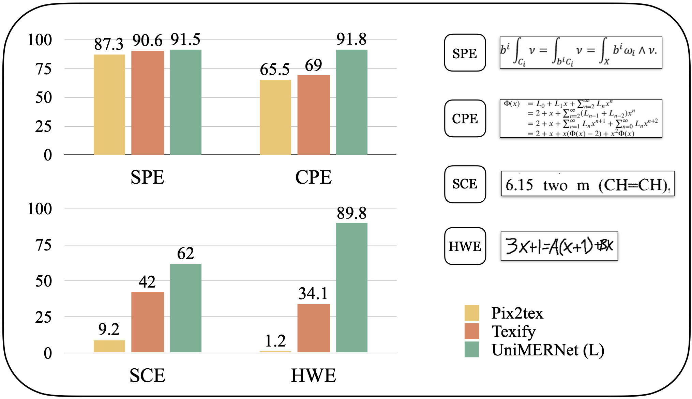
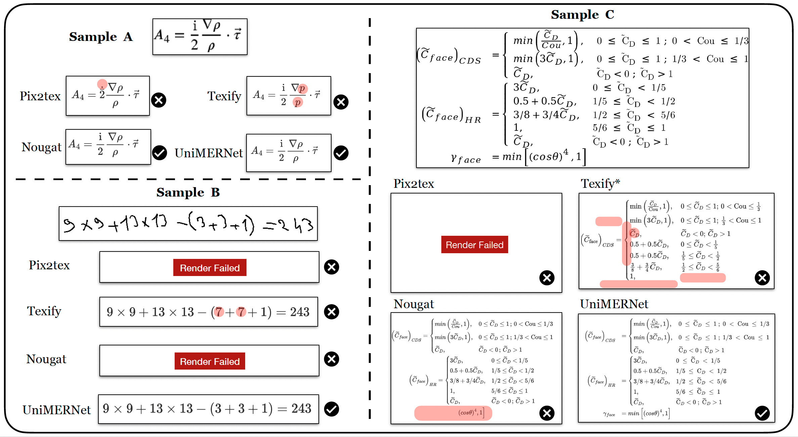

<div align="center">
<h1>UniMERNet: A Universal Network for Real-World Mathematical Expression Recognition</h1>

[](https://arxiv.org/abs/2404.15254)
[](https://huggingface.co/wanderkid/unimernet)

</div>

Welcome to the official repository of UniMERNet, a solution that converts images of mathematical expressions into LaTeX, suitable for a wide range of real-world scenarios.

## News
**2024.4.24** 🎉🎉  Paper now available on [ArXiv](https://arxiv.org/abs/2404.15254).  
**2024.4.24** 🎉🎉  Inference code and checkpoints have been released. 


## Quick Start

### Clone the repo and download the model
```bash
git clone https://github.com/opendatalab/UniMERNet.git
```

```bash
cd UniMERNet/models
# Download the model and tokenizer individually or use git-lfs
git lfs install
git clone https://huggingface.co/wanderkid/unimernet
```

### Installation

``` bash 
conda create -n unimernet python=3.10

conda activate unimernet

pip install unimernet
```

### Run the demo
> Input an image and predict the LaTeX code

```bash
python demo.py
```
> Input an image and obtain the LaTeX code and corresponding rendered image

```bash
jupyter-lab ./demo.ipynb
```


## Performance Comparison (BLEU) with SOTA Methods.
> UniMERNet significantly outperforms mainstream models in recognizing real-world mathematical expressions, demonstrating superior performance across Simple Printed Expressions (SPE), Complex Printed Expressions (CPE), Screen-Captured Expressions (SCE), and Handwritten Expressions (HWE), as evidenced by the comparative BLEU Score evaluation.  



## Visualization Result with Different Methods.
> UniMERNet excels in visual recognition of challenging samples, outperforming other methods.  




## TODO

- [x] Release inference code and checkpoints of UniMERNet.
- [ ] Release UniMER-1M and UniMER-Test.
- [ ] Release the training code for UniMERNet.

## Citation
If you find our models / code / papers useful in your research, please consider giving us a star ⭐ and citing our work 📝, thank you :)
```bibtex
@misc{wang2024unimernet,
      title={UniMERNet: A Universal Network for Real-World Mathematical Expression Recognition}, 
      author={Bin Wang and Zhuangcheng Gu and Chao Xu and Bo Zhang and Botian Shi and Conghui He},
      year={2024},
      eprint={2404.15254},
      archivePrefix={arXiv},
      primaryClass={cs.CV}
}
```

## Acknowledgements
- [VIGC](https://github.com/opendatalab/VIGC). The model framework is dependent on VIGC.
- [Texify](https://github.com/VikParuchuri/texify). A mainstream MER algorithm, UniMERNet data processing refers to Texify.
- [Latex-OCR](https://github.com/lukas-blecher/LaTeX-OCR). Another mainstream MER algorithm.
- [Donut](https://huggingface.co/naver-clova-ix/donut-base). The UniMERNet's Transformer Encoder-Decoder are referenced from Donut.
- [Nougat](https://github.com/facebookresearch/nougat). The tokenizer uses Nougat.

## Contact Us
If you have any questions, comments, or suggestions, please do not hesitate to contact us at wangbin@pjlab.org.cn.

## License
[Apache License 2.0](LICENSE)