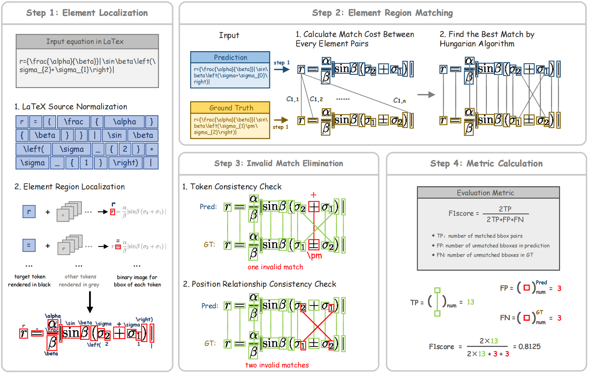
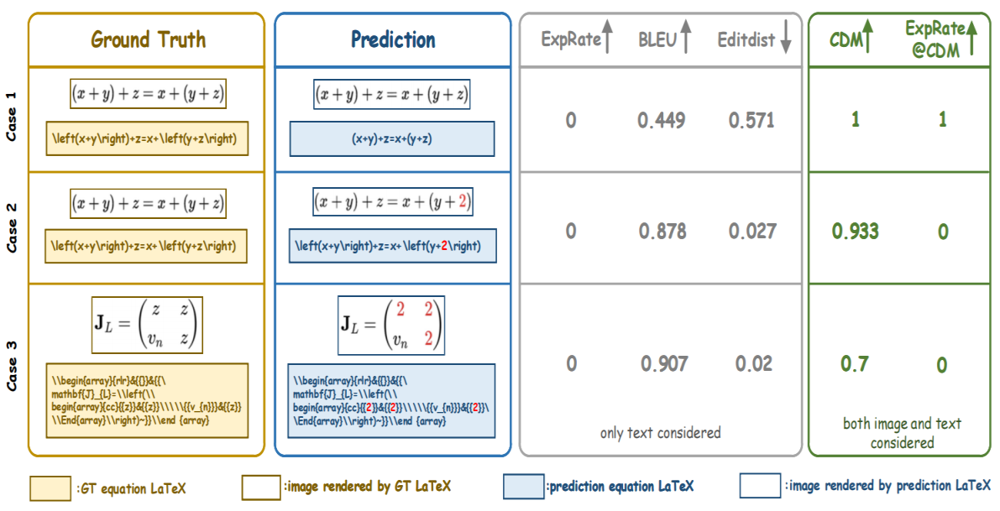

<div align="center">

[English](./README.md) | [简体中文]

<h1>CDM: A Reliable Metric for Fair and Accurate Formula Recognition</h1>

[[ 论文 ]](https://arxiv.org/pdf/2409.03643) [[ 网站 ]](https://github.com/opendatalab/UniMERNet/tree/main/cdm)
[[在线Demo 🤗(Hugging Face)]](https://huggingface.co/spaces/opendatalab/CDM-Demo)

</div>


# 概述

CDM的算法流程以及和BLEU等指标的案例对比如下所示：

<div align="center">
    
    
</div>

# 

# 使用方法

## 尝试在线Demo

尝试CDM在线Demo: [(Hugging Face)🤗](https://huggingface.co/spaces/opendatalab/CDM-Demo)

## 本地安装CDM

考虑到CDM的环境依赖相对比较复杂，我们推荐在Linux系统上进行尝试。

## 准备环境

需要的依赖包括：Nodejs, imagemagic, pdflatex，请按照下面的指令进行安装：

### 步骤.1 安装 nodejs

```
wget https://registry.npmmirror.com/-/binary/node/latest-v16.x/node-v16.13.1-linux-x64.tar.gz

tar -xvf node-v16.13.1-linux-x64.tar.gz

mv node-v16.13.1-linux-x64/* /usr/local/nodejs/

ln -s /usr/local/nodejs/bin/node /usr/local/bin

ln -s /usr/local/nodejs/bin/npm /usr/local/bin

node -v
```

### 步骤.2 安装 imagemagic

`apt-gt`命令安装的imagemagic版本是6.x，我们需要安装7.x的，所以从源码编译安装：
```
git clone https://github.com/ImageMagick/ImageMagick.git ImageMagick-7.1.1

cd ImageMagick-7.1.1

./configure

make

sudo make install

sudo ldconfig /usr/local/lib

convert --version
```

### 步骤.3 安装 latexpdf

```
apt-get update

sudo apt-get install texlive-full
```

### step.4 安装 python 依赖

```
pip install -r requirements.txt
```


## 使用CDM

如果安装过程顺利，现在可以使用CDM对公式识别的结果进行评测了。

### 1. 批量评测 

```
python evaluation.py -i {path_to_your_input_json}
```

输入的json格式如下所示:
```
[
    {
        "img_id": "case_1",      # 非必须的key
        "gt": "y = 2z + 3x",
        "pred": "y = 2x + 3z"
    },
    {
        "img_id": "case_2",
        "gt": "y = x^2 + 1",
        "pred": "y = x^2 + 1"
    },
    ...
]
```

### 2. 启动 gradio demo

```
python app.py
```